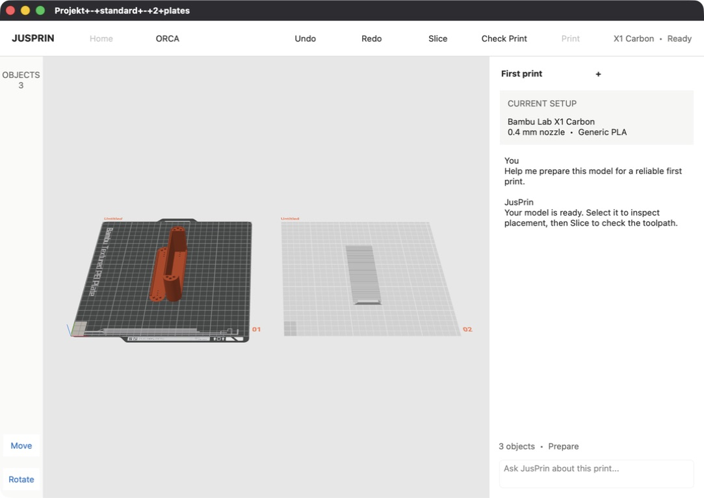
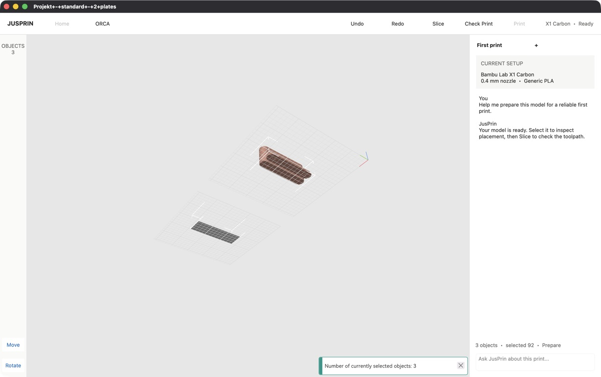
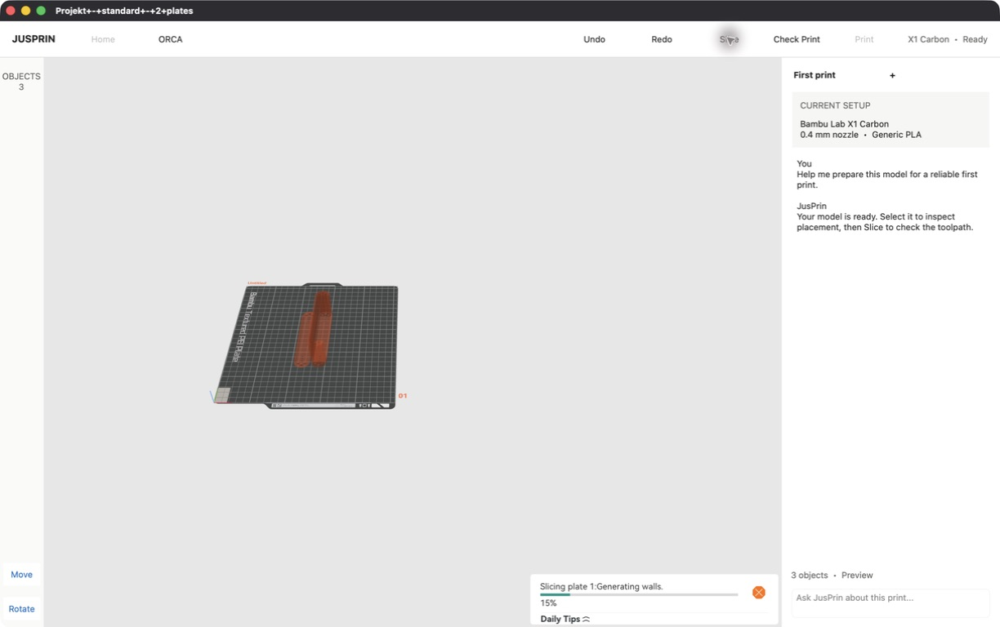
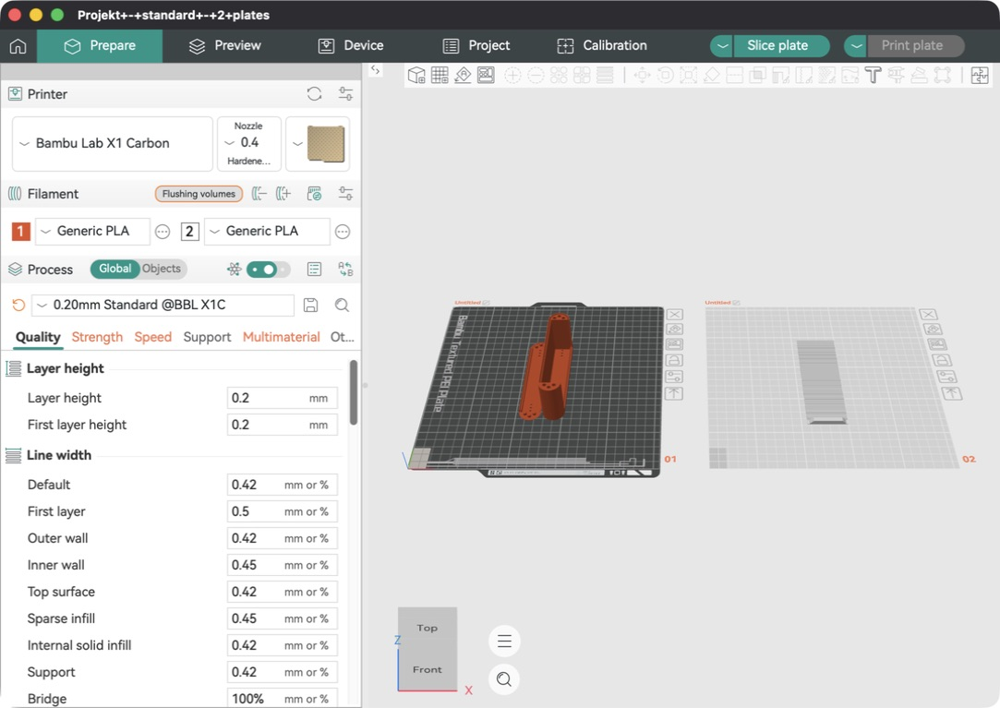

# Orca full-window UI coupling spike results

## 1. Starting commit, worktree, and build configuration

- Branch: `jusprin-v2-poc`
- Starting and final HEAD: `500c64d6eb77155c7361620dd112327334cc5ed0`
- Starting state: the relevant workspace-adapter and invisible-legacy experiments were already committed; the supplied spike handoff document was untracked. No pre-existing production-file edit was incorporated into this spike.
- Platform/configuration: macOS arm64, CMake/Ninja, `RelWithDebInfo`, C++17.
- Application build: `cmake --build build/arm64 --config RelWithDebInfo --target OrcaSlicer --`
- Spike launch: `JUSPRIN_FULL_WINDOW_UI_SPIKE=1 JUSPRIN_FULL_WINDOW_UI_SPIKE_LOG=agent-docs/orca-full-window-ui-coupling-spike-evidence/full-window.log build/arm64/src/RelWithDebInfo/OrcaSlicer.app/Contents/MacOS/OrcaSlicer /Users/kenneth/Downloads/stls/Projekt+-+standard+-+2+plates.3mf`
- Legacy-control launch: the same command with both spike environment variables absent.
- Final worktree: five modified tracked production/build files; two new fork-owned production files; the handoff, this report, and runtime evidence are untracked. No commit was created.

## 2. Verdict: Pass

Proceed with the in-place shell boundary. Events A-C passed against Orca's real canvas, project, slicer, Preview, gizmos, and undo stack. The shell is in two fork-owned files. Excluding build registration, four upstream-owned files changed by 50 additions and 5 removals across six implementation functions, plus one header declaration block. No Orca algorithm was copied, no mutable project state was mirrored, no invisible control received synthetic input, and the default layout was unchanged when the flag was absent.

The main qualification is that `GLCanvas3D::on_mouse()` and overlay rendering are active upstream hotspots. The spike's presentation enum should become an explicit, stable chrome-versus-capability contract before this becomes a long-lived product surface.

## 3. Screenshot comparison and design differences

| State | Evidence | Result |
|---|---|---|
| Legacy baseline |  | Existing Orca top bar, tab strip, sidebar, object list, presets, and stock canvas chrome visible. |
| JusPrin Prepare |  | White top row, collapsed Objects rail, real center viewport, and fixed setup/chat pane occupy the existing main window. No legacy chrome is visible. |
| Selected after maximize and orbit |  | Shell survives maximize; camera changed and the adapter reports selected object `92`, matching the highlighted three-object selection. |
| Existing Preview |  | The real G-code Preview replaces Prepare only in the center while the shell remains fixed. |
| Default after implementation |  | With the flag absent, the original Orca layout still appears. |

The spike matches the supplied structure and approximate neutral palette, spacing, and proportions. It intentionally uses text buttons and a static transcript/setup card instead of final icons, assets, shadows, agent WebView, or responsive behavior. Plate labels/numbers remain because they are semantic viewport content. Preview's native G-code legend and sliders remain because they belong to the required existing Preview, not the Prepare resting chrome.

## 4. Runtime ownership and layout

`MainFrame` remains the only top-level application window. In spike mode its existing main sizer hosts one fork-owned `FullWindowUiSpike`. That panel owns the top navigation, Objects rail, center host, and right pane. The existing `Plater` is reparented into the center host; its existing `View3D`, Preview, `wxGLCanvas`, `GLCanvas3D`, model, selection, and AUI-managed views remain authoritative.

The legacy tab panel, Sidebar, and ObjectList remain constructed but are excluded from the visible layout. Each real canvas is held by a fork-owned `GLCanvas3DWrapper`. The wrapper applies generic `GLCanvasPresentationOptions` that suppress stock chrome and its hidden hit targets while retaining the active gizmo's native input path. Destruction restores the exact options that were present before the wrapper was created.

## 5. Ordered hard-event results

### Event A — real viewport in the new shell: passed

1. Loaded the two-plate `.3mf` containing three objects into spike mode.
2. Confirmed the center is the existing production `GLCanvas3D`, not a copy or screenshot.
3. Used the visible canvas to orbit, pan, and zoom; the resulting camera changes are recorded in `orbit.png`, `pan.png`, and `zoom.png`.
4. Clicked model geometry; `selected.png` shows the selection and `IWorkspace::snapshot()` reported stable ID `92` in that run.
5. Maximized, restored, and maximized again without revealing a legacy panel (`maximized.png`, `maximized-repeat.png`).
6. Repeated selection and orbit after maximize. `maximized-orbit-selection.png` shows the changed camera and selection; `maximized-event.log` records three objects and selected ID `92`.

The final maximize-repeat proof used a temporary test hook to send drag events to the visible real canvas after resizing; it never targeted hidden controls and was removed before the final build. Selection, the native gizmo drag, and the other camera checks used normal Computer Use input.

### Event B — Slice and Preview in place: passed

1. Clicked the new `Slice` button.
2. The button exited the active gizmo, requested Orca's normal update, and posted the existing `EVT_GLTOOLBAR_SLICE_PLATE` event.
3. Orca completed its normal slicing path and displayed its existing Preview in the center (`preview.png`). The JusPrin top row, Objects rail, and right pane stayed mounted.
4. Returned through the new `ORCA` button, which calls the existing Prepare view selector. The same three-object project and selected stable ID `103` remained (`prepare-return-selected.png`).
5. Repeated the round trip with selection (`preview-selected-roundtrip.png`). No hidden tab or legacy Slice button was clicked.

### Event C — hidden stock chrome with retained behavior: passed

1. Presentation mode hid the stock main toolbar, assemble/plate action chrome, collapse toolbar, stock gizmo picker, and other Prepare overlays.
2. Selected the model and activated Move, then Rotate, using explicit `GLGizmosManager::open_gizmo()` calls from visible JusPrin buttons (`move-handle-before.png`, `rotate.png`).
3. Dragged the visible native Move X-axis handle with normal Computer Use input. `move-handle-after.png` shows the transformed model and Orca's dirty-project marker.
4. The existing gizmo created Orca's normal undo snapshot. New shell Undo restored the original transform/title (`undo.png`); Redo restored the move/dirty state (`redo.png`).
5. Hiding the picker did not disable active handles, model picking, plate/object rendering, or transform semantics.

## 6. Legacy components kept alive

Eight legacy component types remain alive in spike mode:

1. MainFrame top-bar object
2. MainFrame tab panel/notebook
3. `Sidebar`
4. `GUI_ObjectList`
5. GL main toolbar
6. GL assemble toolbar
7. Plater collapse toolbar
8. `GLGizmosManager` and its stock picker state

The Sidebar and ObjectList are behavior/lifetime dependencies of `Plater::priv` and existing project/selection machinery even though their pixels are absent. The gizmo manager is behavior-critical: the picker is hidden, but the same manager and active gizmo own manipulation and undo snapshots. The top bar, tab panel, and stock toolbar objects are retained primarily because their owners construct and reference them throughout Orca's lifetime; deleting or skipping construction would broaden the experiment into a lifecycle refactor. No legacy panel, dialog, focus transfer, or visual flash surfaced during the tested workflows.

## 7. Existing APIs reused and seams introduced

Reused behavior-oriented APIs and events:

- `OrcaWorkspaceAdapter::snapshot()`, `subscribe()`, `undo()`, and `redo()` for shell state and history commands.
- `Plater::select_view_3D()` for Prepare/Preview switching and `Plater::is_preview_shown()` for status.
- `Plater::exit_gizmo()`, `Plater::update()`, and existing `EVT_GLTOOLBAR_SLICE_PLATE` for normal slicing orchestration.
- `GLGizmosManager::open_gizmo()` for explicit Move/Rotate activation.
- The existing `GLCanvas3D`, selection, scene raycaster, active gizmo, render loop, and model state.

New seams:

- `GLCanvasPresentationOptions` and `set_presentation_options()` independently control overlay rendering, overlay hit testing, plate-control rendering, and plate-control hit testing.
- Fork-owned `GLCanvas3DWrapper` selects the JusPrin values, restores the prior values with RAII, and owns Move/Rotate activation. No JusPrin name or policy appears in `GLCanvas3D`.
- One environment-gated attachment in `MainFrame::update_layout()` creates the fork-owned shell.
- One environment-gated guard in `Plater::priv::enable_sidebar()` prevents later view/load paths from remounting the legacy sidebar.

All presentation options default to enabled, preserving original Orca behavior; the absent-flag path never names or constructs a fork-owned type at runtime.

## 8. Build, test, and runtime evidence

- Final clean application build: passed for target `OrcaSlicer` in `RelWithDebInfo`.
- Wrapper refactor verification: the full `all` target and the incremental rebuild both passed in `RelWithDebInfo`.
- Full CTest run: 199 of 200 tests passed. `Scenario: Placeholder parser coFloatsOrPercents vector access` reproducibly segfaults because this branch's `PrintConfig.cpp` defines `small_perimeter_speed` as scalar `coFloatOrPercent`, while the test requests `ConfigOptionFloatsOrPercentsNullable`. Current upstream defines that setting as `coFloatsOrPercents`; this is a branch integration mismatch outside the canvas refactor.
- Fresh application-level verification after the wrapper refactor passed on macOS. A real three-object/two-plate project rendered in the JusPrin shell without the stock Prepare toolbar or plate controls. After selecting visible model geometry, the JusPrin `Move` button displayed Orca's native translation handles and the log recorded `command move active`. `Check Print` switched to Preview and completed real G-code generation; `ORCA` returned to Prepare. The same log recorded `command preview` and `command prepare`.
- Workspace contract tests: 7 tests, 41 assertions, all passed via `ctest --test-dir build/arm64/tests/workspace -C RelWithDebInfo --output-on-failure`.
- Patch hygiene: `git diff --check` passed after removal of all verification-only code.
- Spike launch: passed with a real three-object/two-plate project.
- Default launch with the flag absent: passed and visually matched the baseline.
- Events A-C: manually exercised in the running app; screenshots and ordered adapter/command logs are under `orca-full-window-ui-coupling-spike-evidence/`.
- Build warnings were confined to existing upstream declarations and the pre-existing `SimpleEvent` forward-declaration tag mismatch; there was no new build error in the final source.
- Not tested: Windows/Linux runtime presentation and platform-specific focus behavior. The changed code compiles only in the macOS build exercised here. No large widget snapshot test was added because the handoff identifies the real application workflow as the primary evidence.

## Coupling and rebase ledger

Section 9.

| File | Ownership | Lines +/− | Integration point | Why required | Coupling kind | Expected upstream churn | Containment/removal path | Risk |
|---|---|---:|---|---|---|---|---|---|
| `src/slic3r/GUI/JusPrin/FullWindowUiSpike.cpp` | Fork-owned | +302/−0 | Builds shell; reparents Plater; wires adapter and commands | Own the experimental surface without distributing UI code through Orca | Widget ownership/lifetime; Layout/parenting; State/selection; Command/behavior; Event ordering | Low; fork-owned | Delete component and the one MainFrame attachment | Medium |
| `src/slic3r/GUI/JusPrin/FullWindowUiSpike.hpp` | Fork-owned | +14/−0 | Single shell factory declaration | Keep the upstream attachment limited to a factory call | Widget ownership/lifetime | Low; fork-owned | Delete with implementation | Low |
| `src/slic3r/CMakeLists.txt` | Build registration | +4/−0 | Registers the shell and canvas-wrapper sources | Required for compilation | Build/resources | Medium; central source list | Remove four entries | Low |
| `src/slic3r/GUI/JusPrin/GLCanvas3DWrapper.cpp` | Fork-owned | New file | Applies JusPrin presentation values and activates Move/Rotate | Keep product policy out of Orca canvas code | Visibility/presentation; Input/focus; Command/behavior | Low; fork-owned | Delete with the shell | Low |
| `src/slic3r/GUI/JusPrin/GLCanvas3DWrapper.hpp` | Fork-owned | New file | Declares the narrow existing-canvas wrapper | Give the shell one stable canvas dependency | Widget ownership/lifetime; Visibility/presentation | Low; fork-owned | Delete with the shell | Low |
| `src/slic3r/GUI/MainFrame.cpp` | Upstream attachment point | +14/−0 | `MainFrame::update_layout()` Old-layout branch | Necessary to place the shell inside the existing main window | Widget ownership/lifetime; Layout/parenting; Visibility/presentation | High; active app-shell file | Replace with a stable shell-host factory/registration point, or remove the gated block | Medium |
| `src/slic3r/GUI/Plater.cpp` | Upstream presentation seam | +4/−0 | `Plater::priv::enable_sidebar()` | Necessary because later view/load paths otherwise re-enable the hidden sidebar | Layout/parenting; Visibility/presentation; Event ordering | High; active central controller | Expose a persistent public sidebar-presentation policy set once by the shell | Medium |
| `src/slic3r/GUI/GLCanvas3D.hpp` | Upstream presentation seam | Generic options declaration, state, setter/getter | Make rendering and input policies independently configurable | Visibility/presentation; Input/focus; Rendering/OpenGL | High; very active header | Keep the generic contract narrow and product-neutral | Medium |
| `src/slic3r/GUI/GLCanvas3D.cpp` | Upstream presentation seam | Small checks in `render`, `on_mouse`, `_picking_pass`, and `_render_overlays`; one setter | Hide plate controls and overlays and suppress the external collapse-toolbar hit target | Visibility/presentation; Input/focus; Rendering/OpenGL | High; active render/input hotspot | Keep only decisions requiring canvas-private state here | Medium |
| `src/slic3r/GUI/GLToolbar.cpp/.hpp` | Upstream generic input seam | One flag, setter, and early input check | Let an embedded canvas disable toolbar hit testing without disabling toolbar state | Input/focus | No upstream commits in the audited interval | Retain as a generic toolbar capability | Low |
| `src/slic3r/GUI/Gizmos/GLGizmosManager.cpp/.hpp` | Upstream generic input seam | One flag, setter, and condition | Disable gizmo-toolbar hit testing while preserving current-gizmo input | Input/focus; Command/behavior | Three upstream commits across both files in the audited interval | Retain as a generic gizmo capability | Low |

Upstream-change audit:

- `MainFrame.cpp`: necessary, localized to one function plus includes, and reusable for future JusPrin screens. The default Orca function executes, but the new branch is not entered unless the exact flag value is `1`. It is a rebase hotspot. Most logic is already fork-owned; a smaller stable factory/host attachment could remove the fork include from this file.
- `Plater.cpp`: necessary after runtime reproduction showed the sidebar returning, localized to one function, and reusable as a general persistent sidebar-visibility policy. The default function executes but the added condition is false without the flag. It is a high-churn hotspot. The decision cannot safely move wholly into the shell because later Plater paths own remounting; a public policy setter would be the smaller boundary.
- `GLCanvas3D.hpp`: necessary, localized to a product-neutral options declaration and one setter/getter pair. All defaults preserve original Orca behavior. The header remains high-churn, but it no longer names JusPrin or encodes a two-product mode.
- `GLCanvas3D.cpp`: still contains the small checks that require canvas-private rendering and plate-picking state. Most custom mouse routing was removed from `GLCanvas3D::on_mouse()`; ordinary toolbars now reject input through `GLToolbar`, and `GLGizmosManager` suppresses only its toolbar before continuing to the active gizmo.
- `GLToolbar.cpp/.hpp` and `GLGizmosManager.cpp/.hpp`: generic input-capability seams in substantially quieter upstream files. In the audited upstream interval, `GLCanvas3D.cpp` changed in 43 commits, versus zero for both `GLToolbar` files and three total across both gizmo-manager files.

Totals:

- Fork-owned production files changed: **4**
- Upstream-owned production files changed, excluding build lists: **8**
- Current upstream-owned additions/removals relative to the pre-spike commit: **+69/−5**
- `GLCanvas3D` still modifies `render`, `on_mouse`, `_picking_pass`, and `_render_overlays`, but the repeated toolbar and manual gizmo-dispatch branches have moved out of `on_mouse()` into generic lower-churn input seams.
- Direct Orca types referenced by fork-owned code: **4** (`Plater`, `GLCanvas3D`, `GLGizmosManager`, `SimpleEvent`)
- Copied Orca behavior blocks or algorithms: **0**
- Legacy component types kept alive for Events A-C: **8**

## 10. Failed or abandoned coupling attempts

| Attempt | Expected seam | Actual dependency found | Workaround used | Architectural implication |
|---|---|---|---|---|
| Reparent existing Plater once and hide Sidebar | Shell controls the final layout | Later view/load paths call `enable_sidebar(true)` and remount it | Narrow exact-flag guard in `Plater::priv::enable_sidebar()` | Sidebar visibility is policy state, not a one-time layout operation |
| Skip overlay rendering only | Invisible chrome would stop participating | Toolbar and picker hit targets can still consume visible-canvas input | Disable toolbar hit testing through generic `GLToolbar` and `GLGizmosManager` controls while keeping current-gizmo input active | Visibility and capability require separate controls |
| Use `only_body` to hide plate action stacks | All plate chrome would disappear | Bed picker hit regions still changed hover/input state | Disable Bed picking through `handle_plate_input` | Render suppression must be paired with matching picking policy |
| Give `wxGLCanvas` an accessibility name | Easier semantic automation target | macOS accessibility state enumeration repeatedly timed out | Removed the name; verified through the containing app and real canvas pixels | Native GL canvas lacks a reliable semantic automation seam |
| Send coordinate input to a copied app with Orca's duplicate bundle identity | Strict native visible-handle test | Computer Use could not resolve a unique window (`noWindowsAvailable`) | Used a fresh temporary app copy with a unique bundle ID, then trashed it | Test harnesses need unique application identity; no production workaround is needed |
| Use `wxUIActionSimulator` for handle drag | OS-native-looking input from a test helper | macOS reported success but dropped cursor events | Abandoned and removed; used Computer Use against the visible native handle | Simulator success is not evidence of GL canvas input on macOS |
| One-shot visible-canvas drag after maximize | Deterministic repeat of Event A after resize | No stable public camera-test API exists | Temporary direct visible-canvas event hook, captured evidence, then removed | A future testability seam may be useful; hidden controls were never involved |

## 11. Highest-risk rebase hotspots

1. `GLCanvas3D::_render_overlays()` and `render()` remain the largest canvas-specific risk. The generic checks are small, but they still depend on Orca continuing to classify hidden chrome beneath `_render_overlays()` and on the meaning of `only_body` remaining appropriate for suppressing plate controls.
2. `GLCanvas3D::on_mouse()` now has only the presentation check for the external collapse toolbar. The previous duplicated toolbar conditions and manual current-gizmo dispatch were removed. Toolbar and gizmo-manager input controls carry that policy through lower-churn generic seams.
3. `Plater::priv::enable_sidebar()` is a central policy method reached from many workflows. The exact environment check is appropriate for a spike but should become state set through a public presentation API.
4. `MainFrame::update_layout()` is a busy attachment point, though the spike block is localized and easy to remove.

## 12. Recommended production boundary

Keep the overall composition: one fork-owned shell inside the existing `MainFrame`, hosting the existing `Plater`/Prepare/Preview center and using `IWorkspace` for state/history. Retain a single MainFrame shell-factory attachment.

The JusPrin-named GL enum has been replaced with a generic canvas presentation-options contract, and fork-owned `GLCanvas3DWrapper` now owns the product-specific values and commands. Before productionizing, add a persistent public Plater sidebar-presentation policy so the shell does not rely on an environment check inside `Plater::priv`. Keep Slice and view switching as explicit behavior APIs/events; do not expose private Plater internals or mirror their state.

The smallest follow-up proof should rerun Event C through the generalized canvas contract and Event B through a stable center-view host, with the legacy flag absent as a regression check.

## 13. Human product and architecture decisions

- Decide whether Preview's native legend/sliders and plate labels/numbers are acceptable semantic viewport content or need their own product presentation options.
- Decide whether the production shell should retain access to the native menu bar/global shortcuts while legacy navigation is hidden.
- Choose the real Check Print and Print behavior; both were intentionally out of scope, and Print/Home remain disabled placeholders.
- Choose the agent pane technology, data flow, authentication, and failure states; the spike contains only static native controls.
- Decide whether future screens justify a formal MainFrame shell-host interface or whether one factory attachment remains sufficient.
- Set the cross-platform visual/focus verification matrix before shipping. This spike exercised macOS only; Windows and Linux still require runtime proof.
- Decide when to remove the still-live legacy topbar/tab/sidebar objects. They are contained today, but lifecycle deconstruction is a separate architectural project rather than part of this shell spike.
